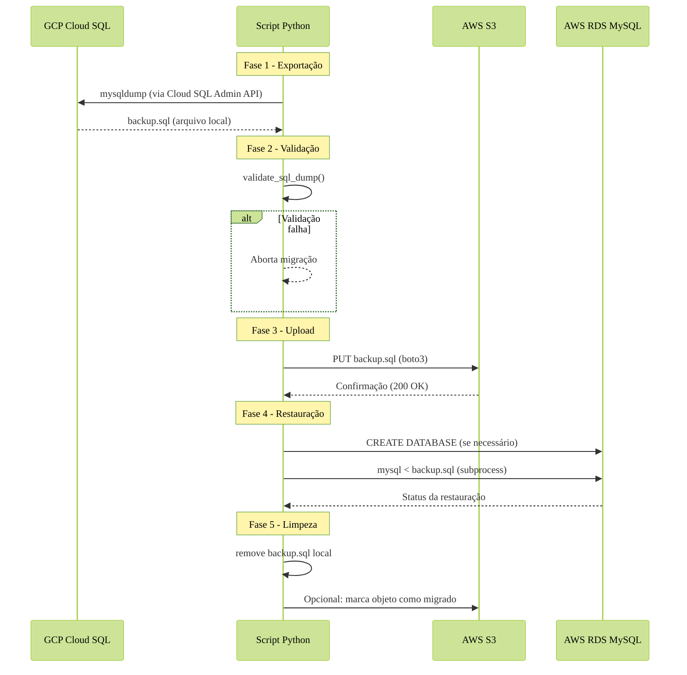

> 🚧 Projeto em andamento 🚧

# App para migração de Database

## 🎯 Objetivo:
- o objetivo do projeto é automatizar a migração de base de dados para diversas clouds - no momento, **AWS** e **GCP**;

## 🔄 Fluxo da Migração GCP -> AWS

O processo segue estas etapas principais:

1. **Exportação**: Geração do dump no GCP via `mysqldump`
2. **Validação**: Verificação de integridade do arquivo
3. **Upload**: Transferência segura para o S3
4. **Restauração**: Carga dos dados no RDS
5. **Limpeza**: Remoção de arquivos temporários

# Como usar? 🦧

1. Baixar **AWS CLI**, **GCloud CLI** ou o da nuvem de sua preferência. Os mesmos já criam varíaveis de ambientes ocultas que podemos passar no _config.yaml_ - Recomendado;
    1.5. Pode-se passar as variáveis por um .env, mas fica mais complexo e pode dar problemas de importação e leitura do _environment_, para isso é necessária uma configuração mais precisa, até para impedir que _dados sensíveis_ fiquem expostos.
2. 

