# App para migração de Database

## 🎯 Objetivo:
- o objetivo do projeto é automatizar a migração de base de dados para diversas clouds - no momento, **AWS** e **GCP**;

## 🔄 Fluxo da Migração GCP -> AWS

O processo segue estas etapas principais:

1. **Exportação**: Geração do dump no GCP via `mysqldump`
2. **Validação**: Verificação de integridade do arquivo
3. **Upload**: Transferência segura para o S3
4. **Restauração**: Carga dos dados no RDS
5. **Limpeza**: Remoção de arquivos temporários

```mermaid
%%{init: {'theme': 'forest', 'fontFamily': 'OpenSans', 'gantt': {'barHeight': 20}}}%%
sequenceDiagram
    participant GCP as GCP Cloud SQL
    participant SCRIPT as Script Python
    participant S3 as AWS S3
    participant RDS as AWS RDS MySQL
    
    Note over SCRIPT: Fase 1 - Exportação
    SCRIPT->>GCP: mysqldump (via Cloud SQL Admin API)
    GCP-->>SCRIPT: backup.sql (arquivo local)
    
    Note over SCRIPT: Fase 2 - Validação
    SCRIPT->>SCRIPT: validate_sql_dump()
    alt Validação falha
        SCRIPT-->>SCRIPT: Aborta migração
    end
    
    Note over SCRIPT: Fase 3 - Upload
    SCRIPT->>S3: PUT backup.sql (boto3)
    S3-->>SCRIPT: Confirmação (200 OK)
    
    Note over SCRIPT: Fase 4 - Restauração
    SCRIPT->>RDS: CREATE DATABASE (se necessário)
    SCRIPT->>RDS: mysql < backup.sql (subprocess)
    RDS-->>SCRIPT: Status da restauração
    
    Note over SCRIPT: Fase 5 - Limpeza
    SCRIPT->>SCRIPT: remove backup.sql local
    SCRIPT->>S3: Opcional: marca objeto como migrado
```

